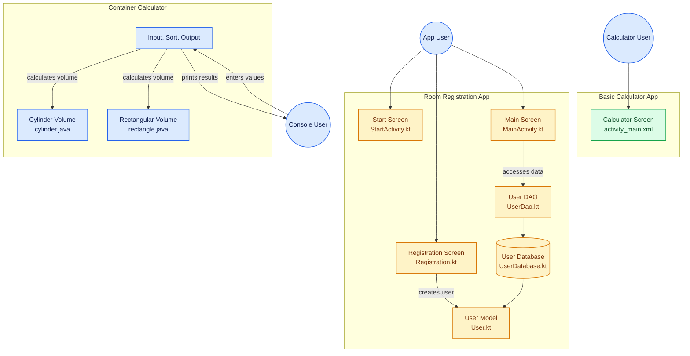

### MSP Tasks

## Tasks Architectures

```mermaid
flowchart TD

subgraph group_container["Container Calculator"]
  node_container_main["Input, Sort, Output"]
  node_cylinder["Cylinder Volume<br/>cylinder.java"]
  node_rectangle["Rectangular Volume<br/>rectangle.java"]
end

subgraph group_room["Room Registration App"]
  node_room_start["Start Screen<br/>StartActivity.kt"]
  node_room_registration["Registration Screen<br/>Registration.kt"]
  node_room_main["Main Screen<br/>MainActivity.kt"]
  node_user_model["User Model<br/>User.kt"]
  node_user_dao["User DAO<br/>UserDao.kt"]
  node_user_database[("User Database<br/>UserDatabase.kt")]
end

subgraph group_basiccalc["Basic Calculator App"]
  node_calculator_screen["Calculator Screen<br/>activity_main.xml"]
end

node_user(("Console User"))
node_android_user(("App User"))
node_calculator_user(("Calculator User"))

node_user -->|"enters values"| node_container_main
node_container_main -->|"calculates volume"| node_cylinder
node_container_main -->|"calculates volume"| node_rectangle
node_container_main -->|"prints results"| node_user

node_android_user --> node_room_start
node_android_user --> node_room_registration
node_android_user --> node_room_main

node_room_registration -->|"creates user"| node_user_model
node_room_main -->|"accesses data"| node_user_dao
node_user_dao --> node_user_database
node_user_database --> node_user_model

node_calculator_user --> node_calculator_screen

click node_container_main "https://github.com/yassakamille/msp_tasks/blob/main/Task%201/src/javaapplication1/JavaApplication1.java"
click node_cylinder "https://github.com/yassakamille/msp_tasks/blob/main/Task%201/src/javaapplication1/cylinder.java"
click node_rectangle "https://github.com/yassakamille/msp_tasks/blob/main/Task%201/src/javaapplication1/rectangle.java"
click node_room_start "https://github.com/yassakamille/msp_tasks/blob/main/Task-3-RoomDB/app/src/main/java/com/example/room/StartActivity.kt"
click node_room_registration "https://github.com/yassakamille/msp_tasks/blob/main/Task-3-RoomDB/app/src/main/java/com/example/room/Registration.kt"
click node_room_main "https://github.com/yassakamille/msp_tasks/blob/main/Task-3-RoomDB/app/src/main/java/com/example/room/MainActivity.kt"
click node_user_model "https://github.com/yassakamille/msp_tasks/blob/main/Task-3-RoomDB/app/src/main/java/com/example/room/data/User.kt"
click node_user_dao "https://github.com/yassakamille/msp_tasks/blob/main/Task-3-RoomDB/app/src/main/java/com/example/room/data/UserDao.kt"
click node_user_database "https://github.com/yassakamille/msp_tasks/blob/main/Task-3-RoomDB/app/src/main/java/com/example/room/data/UserDatabase.kt"
click node_calculator_screen "https://github.com/yassakamille/msp_tasks/blob/main/Task_2-BasicCalculator/app/src/main/res/layout/activity_main.xml"

classDef toneNeutral fill:#f8fafc,stroke:#334155,stroke-width:1.5px,color:#0f172a
classDef toneBlue fill:#dbeafe,stroke:#2563eb,stroke-width:1.5px,color:#172554
classDef toneAmber fill:#fef3c7,stroke:#d97706,stroke-width:1.5px,color:#78350f
classDef toneMint fill:#dcfce7,stroke:#16a34a,stroke-width:1.5px,color:#14532d
classDef toneRose fill:#ffe4e6,stroke:#e11d48,stroke-width:1.5px,color:#881337
classDef toneIndigo fill:#e0e7ff,stroke:#4f46e5,stroke-width:1.5px,color:#312e81
classDef toneTeal fill:#ccfbf1,stroke:#0f766e,stroke-width:1.5px,color:#134e4a

class node_container_main,node_cylinder,node_rectangle,node_user,node_android_user,node_calculator_user toneBlue
class node_room_start,node_room_registration,node_room_main,node_user_model,node_user_dao,node_user_database toneAmber
class node_calculator_screen toneMint
```

## 
